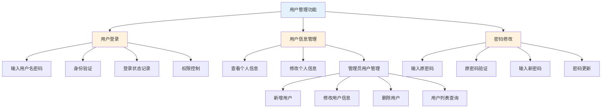
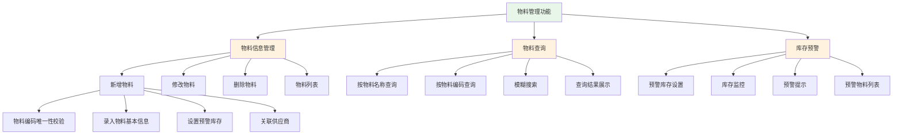
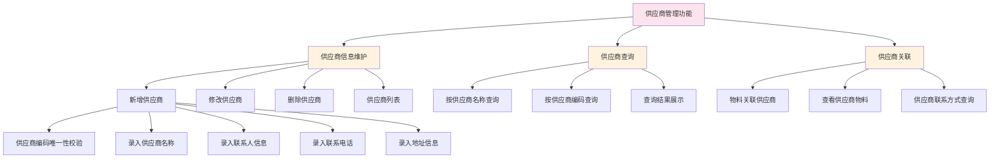
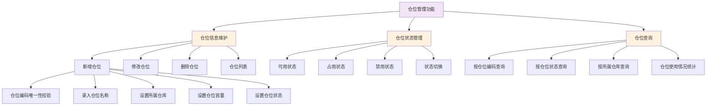
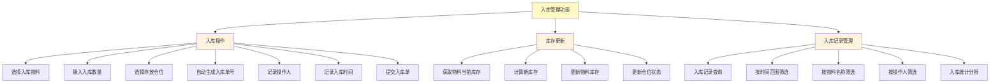
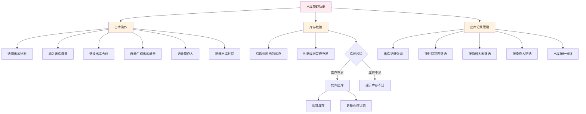
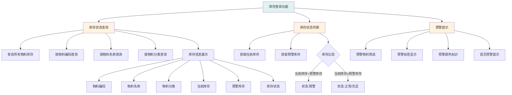
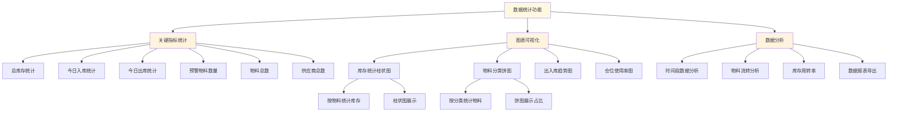

# 智能仓库管理系统功能结构图（按章节）

## 图3-1 用户管理功能结构图

## 图3-2 物料管理功能结构图

## 图3-3 供应商管理功能结构图

## 图3-4 仓位管理功能结构图

## 图3-5 入库管理功能结构图

## 图3-6 出库管理功能结构图

## 图3-7 库存查询功能结构图

## 图3-8 数据统计功能结构图

---

## 使用说明

### 图的插入位置

- **图3-1**：插入在3.2.1节"用户管理功能"的开头或结尾
- **图3-2**：插入在3.2.2节"物料管理功能"的开头或结尾
- **图3-3**：插入在3.2.3节"供应商管理功能"的开头或结尾
- **图3-4**：插入在3.2.4节"仓位管理功能"的开头或结尾
- **图3-5**：插入在3.2.5节"入库管理功能"的开头或结尾
- **图3-6**：插入在3.2.6节"出库管理功能"的开头或结尾
- **图3-7**：插入在3.2.7节"库存查询功能"的开头或结尾
- **图3-8**：插入在3.2.8节"数据统计功能"的开头或结尾

### 图注示例

**图3-1 用户管理功能结构图**

如图3-1所示，用户管理功能包括用户登录、用户信息管理和密码修改三个子模块。用户登录模块负责身份验证和权限控制；用户信息管理模块支持普通用户查看和修改个人信息，管理员可以进行用户的增删改查操作；密码修改模块通过原密码验证确保账户安全。

**图3-2 物料管理功能结构图**

如图3-2所示，物料管理功能包括物料信息管理、物料查询和库存预警三个子模块。物料信息管理模块实现物料的增删改查，并通过编码唯一性校验保证数据准确性；物料查询模块支持按名称和编码进行模糊搜索；库存预警模块通过监控库存与预警值的关系，及时提醒管理员补货。

**图3-3 供应商管理功能结构图**

如图3-3所示，供应商管理功能包括供应商信息维护、供应商查询和供应商关联三个子模块。供应商信息维护模块实现供应商的增删改查，记录供应商的基本信息和联系方式；供应商关联模块将供应商与物料建立关联关系，便于采购时快速查找供应商联系方式。

**图3-4 仓位管理功能结构图**

如图3-4所示，仓位管理功能包括仓位信息维护、仓位状态管理和仓位查询三个子模块。仓位信息维护模块实现仓位的增删改查；仓位状态管理模块维护可用、占用、禁用三种状态；仓位查询模块支持按编码、状态、所属仓库等条件查询，并统计仓位使用情况。

**图3-5 入库管理功能结构图**

如图3-5所示，入库管理功能包括入库操作、库存更新和入库记录管理三个子模块。入库操作模块录入入库信息并自动生成入库单号；库存更新模块在入库完成后自动增加物料库存并更新仓位状态；入库记录管理模块支持按时间、物料、操作人等条件查询和统计入库数据。

**图3-6 出库管理功能结构图**

如图3-6所示，出库管理功能包括出库操作、库存校验和出库记录管理三个子模块。出库操作模块录入出库信息；库存校验模块在出库前判断库存是否充足，库存不足时提示用户，库存充足时自动扣减库存；出库记录管理模块支持按多种条件查询和统计出库数据。

**图3-7 库存查询功能结构图**

如图3-7所示，库存查询功能包括库存状态查询、库存状态判断和预警提示三个子模块。库存状态查询模块支持按多种条件查询物料库存信息；库存状态判断模块通过比较当前库存与预警库存，自动计算库存状态；预警提示模块通过颜色标识和首页提示，帮助管理员快速识别需要补货的物料。

**图3-8 数据统计功能结构图**

如图3-8所示，数据统计功能包括关键指标统计、图表可视化和数据分析三个子模块。关键指标统计模块展示总库存、今日出入库、预警物料数量等核心数据；图表可视化模块使用柱状图、饼图等图表形式直观展示库存和物料分类情况；数据分析模块提供时间段分析、流转分析和报表导出功能。
