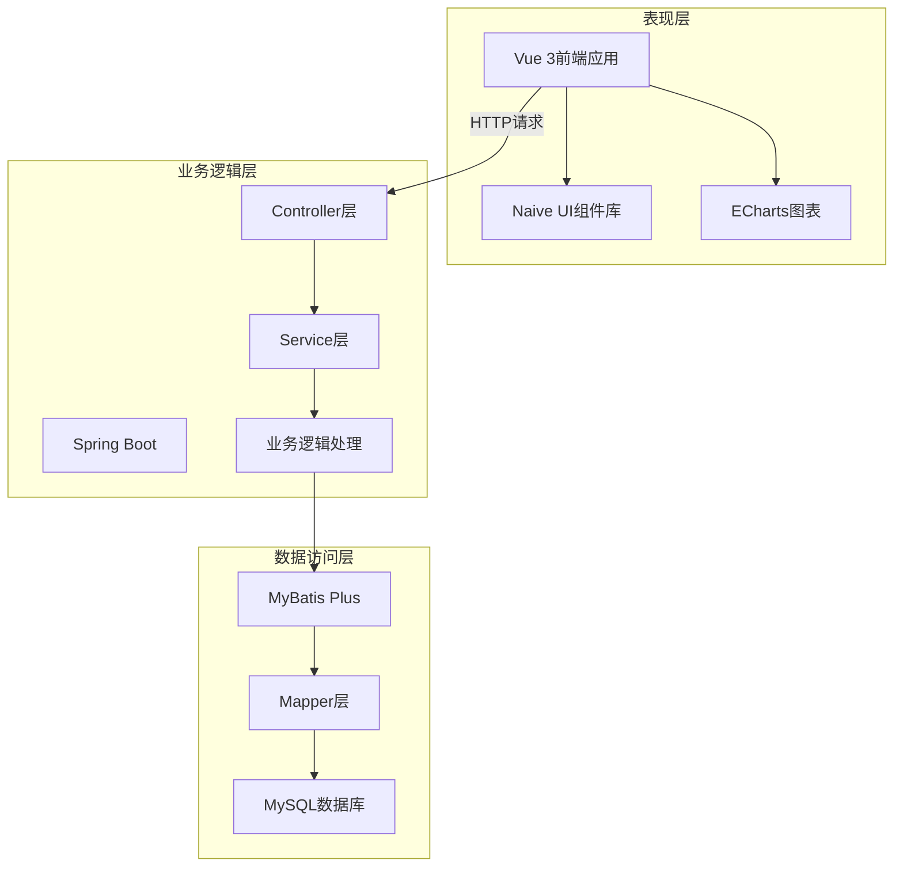
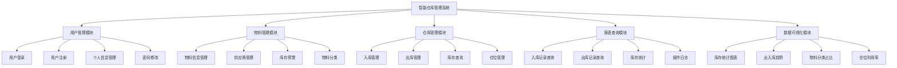
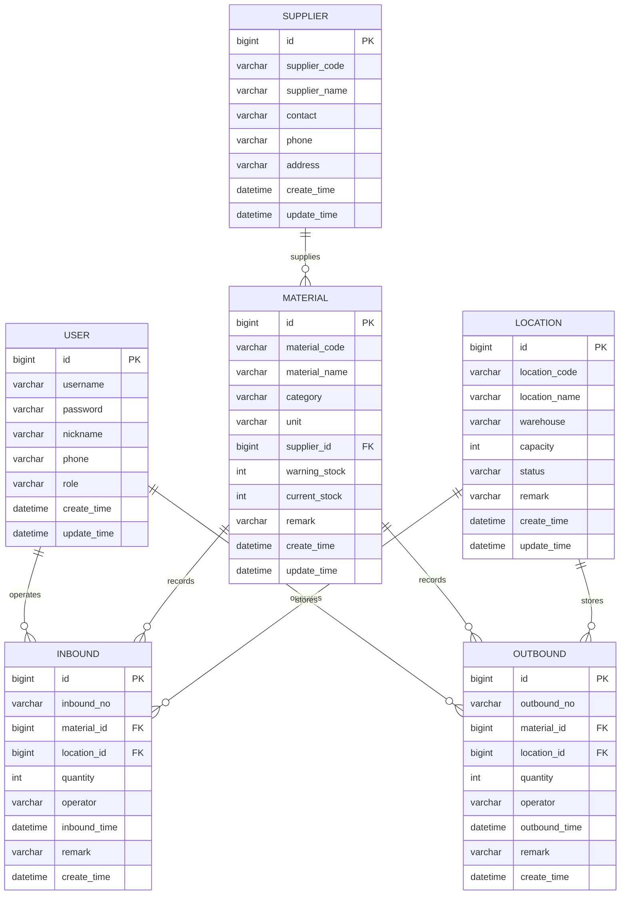

# 第4章 系统设计

系统设计是整个项目开发的核心环节，直接决定了系统的可扩展性和可维护性。在这一章里，会详细介绍智能仓库管理系统的总体架构、功能模块划分以及数据库设计方案。

## 4.1 系统总体架构设计

本系统采用前后端分离的架构模式。说实话，刚开始接触这种架构的时候还有点不太习惯，因为之前做的小项目都是前后端混在一起的。不过实际用下来会发现，前后端分离确实让开发变得更清晰了，前端和后端可以各自专注于自己的业务逻辑。

系统整体分为三层架构：表现层、业务逻辑层和数据访问层。前端使用Vue 3框架负责用户界面的展示和交互，后端使用Spring Boot框架处理业务逻辑和数据操作，数据库采用MySQL存储系统数据。前后端通过RESTful API进行数据交互，数据格式统一采用JSON。

[此处插入系统架构图]

图4-1 系统总体架构图

### 4.1.1 表现层设计

表现层主要负责与用户的交互。采用Vue 3作为前端框架，配合Naive UI组件库实现界面的快速开发。Naive UI这个组件库用起来还是挺方便的，文档也比较清楚，基本上常用的表格、表单、对话框这些组件都有现成的。

表现层的主要职责包括：
- 接收用户的操作指令
- 向后端发送HTTP请求
- 接收后端返回的数据并渲染到页面
- 使用ECharts展示数据统计图表

为了提升用户体验，系统在表现层做了一些优化。比如在数据加载时显示加载动画，操作成功或失败时弹出提示信息，表单提交前进行数据验证等。

### 4.1.2 业务逻辑层设计

业务逻辑层是系统的核心部分，负责处理各种业务规则。这一层采用Spring Boot框架搭建，按照MVC模式进行分层设计。

Controller层接收前端的HTTP请求，解析请求参数，调用Service层的业务方法，最后将处理结果封装成统一的JSON格式返回给前端。在实现过程中，为了让前端能够统一处理响应数据，设计了一个Result类来封装所有的返回结果，包括状态码、提示信息和具体数据。

Service层实现具体的业务逻辑。比如入库操作，不仅要保存入库记录，还要同步更新物料的库存数量。这种涉及多个数据表操作的业务，需要使用事务来保证数据的一致性。如果入库记录保存成功了，但库存更新失败，那整个操作就应该回滚。

### 4.1.3 数据访问层设计

数据访问层负责与数据库进行交互。系统使用MyBatis Plus作为持久层框架，这个框架在MyBatis的基础上做了很多增强。最大的好处就是不用写那些简单的增删改查SQL了，直接调用框架提供的方法就行。

Mapper接口继承MyBatis Plus的BaseMapper，就自动拥有了基本的CRUD方法。对于一些复杂的查询，比如多表关联查询、统计查询这些，可以在Mapper接口里自定义方法，然后在XML文件里写对应的SQL语句。

## 4.2 功能模块设计

根据系统的功能需求分析，将系统划分为五个主要功能模块。这些模块都是在实际开发中真正实现的功能，没有画一些看起来很复杂但实际上没做的模块。

[此处插入功能模块图]

图4-2 系统功能模块图

### 4.2.1 用户管理模块

用户管理模块负责系统的用户认证和权限控制。系统设计了两种角色：普通用户和管理员。

普通用户可以进行入库、出库操作，查看自己的操作记录，修改个人信息。管理员除了拥有普通用户的所有权限外，还可以管理所有用户信息，查看所有操作记录，进行系统配置。

用户登录时，系统会验证用户名和密码。验证通过后，后端生成一个token返回给前端，前端将token保存在localStorage中。之后每次请求都会在请求头中携带这个token，后端通过验证token来确认用户身份。

考虑到本科毕业设计的时间和实现难度，系统没有实现特别复杂的权限控制机制，只是简单地根据用户角色来判断是否有权限执行某个操作。

### 4.2.2 物料管理模块

物料管理模块是系统的基础模块，管理着仓库中所有物料的基本信息。

每个物料都有唯一的物料编码，还包括物料名称、分类、单位、供应商、预警库存等信息。物料编码在系统中是唯一的，不能重复。在添加物料时，系统会自动检查编码是否已存在。

供应商管理是物料管理的一个子模块。每个物料可以关联一个供应商，记录物料的来源信息。供应商信息包括供应商编码、名称、联系人、联系电话和地址。

库存预警功能可以帮助管理员及时了解库存不足的物料。每个物料都可以设置一个预警库存值，当物料的当前库存低于这个值时，系统会在首页的统计卡片中显示预警提示。

### 4.2.3 仓库管理模块

仓库管理模块是系统的核心业务模块，包括入库管理、出库管理、库存查询和仓位管理四个子模块。

入库管理负责处理物料的入库操作。用户选择要入库的物料、输入入库数量、选择存放的仓位，系统会自动生成入库单号，记录入库时间和操作人。入库操作完成后，系统会自动更新物料的当前库存。

出库管理的流程和入库类似，但需要先检查库存是否充足。如果出库数量大于当前库存，系统会提示库存不足，不允许出库。出库成功后，同样会自动更新物料的库存数量。

库存查询可以查看所有物料的当前库存情况，支持按物料名称、物料编码进行搜索。对于库存低于预警值的物料，会用红色标注提醒。

仓位管理用于维护仓库的仓位信息。每个仓位都有唯一的仓位编码，包括仓位名称、所属仓库、容量、状态等信息。仓位状态分为可用、占用、禁用三种。

### 4.2.4 报表查询模块

报表查询模块提供各种数据查询功能，方便用户查看历史操作记录和统计数据。

入库记录查询可以查看所有的入库记录，支持按时间范围、物料名称、操作人进行筛选。每条记录显示入库单号、物料信息、入库数量、仓位、操作人和入库时间。

出库记录查询的功能和入库记录查询类似，可以查看所有的出库记录，支持多种条件筛选。

库存统计可以按物料分类统计各类物料的库存情况，也可以按仓位统计各仓位的库存分布。这些统计数据不仅以表格形式展示，还会通过图表进行可视化展示。

### 4.2.5 数据可视化模块

数据可视化模块使用ECharts图表库，将系统的各种统计数据以图表的形式直观展示出来。这个模块主要在系统首页展示。

库存统计图表使用柱状图展示各类物料的库存数量，可以一目了然地看出哪些物料库存充足，哪些物料库存不足。

出入库趋势图使用折线图展示最近一段时间的出入库数量变化趋势，帮助管理员了解仓库的运营情况。

物料分类占比使用饼图展示不同分类物料的数量占比，可以看出仓库中各类物料的分布情况。

仓位利用率使用仪表盘展示仓位的使用情况，直观地反映仓库空间的利用率。

## 4.3 数据库设计

数据库设计是系统设计的重要组成部分。一个好的数据库设计可以提高系统的性能和可维护性。本系统使用MySQL数据库，设计了6张核心数据表。

### 4.3.1 数据库概念设计

数据库概念设计主要是设计E-R图，明确各个实体之间的关系。

系统中的主要实体包括：用户、物料、供应商、仓位、入库记录、出库记录。

用户实体记录系统用户的基本信息和角色权限。物料实体记录物料的详细信息，包括编码、名称、分类、库存等。供应商实体记录供应商的基本信息。仓位实体记录仓库仓位的信息。入库记录和出库记录实体分别记录物料的入库和出库操作。

实体之间的关系：
- 物料和供应商是多对一关系，一个供应商可以供应多种物料，一种物料只能有一个供应商
- 入库记录和物料是多对一关系，一条入库记录对应一种物料，一种物料可以有多条入库记录
- 入库记录和仓位是多对一关系，一条入库记录对应一个仓位，一个仓位可以有多条入库记录
- 出库记录和物料、仓位的关系与入库记录类似

[此处插入E-R图]

图4-3 系统E-R图

### 4.3.2 数据库逻辑设计

根据E-R图，将概念模型转换为关系模型，设计出具体的数据表结构。

#### 1. 用户表（sys_user）

用户表存储系统用户的基本信息和角色权限。

表4-1 用户表结构

| 字段名 | 数据类型 | 长度 | 允许空 | 默认值 | 主键 | 索引 | 说明 |
|--------|----------|------|--------|--------|------|------|------|
| id | BIGINT | - | 否 | - | 是 | 主键索引 | 用户ID，自增 |
| username | VARCHAR | 50 | 否 | - | 否 | 唯一索引 | 用户名，唯一 |
| password | VARCHAR | 100 | 否 | - | 否 | - | 密码，加密存储 |
| nickname | VARCHAR | 50 | 是 | - | 否 | - | 昵称 |
| phone | VARCHAR | 20 | 是 | - | 否 | - | 手机号 |
| role | VARCHAR | 20 | 是 | user | 否 | 普通索引 | 角色：admin/user |
| create_time | DATETIME | - | 是 | CURRENT_TIMESTAMP | 否 | - | 创建时间 |
| update_time | DATETIME | - | 是 | CURRENT_TIMESTAMP | 否 | - | 更新时间 |

用户表的username字段设置了唯一索引，保证用户名不会重复。role字段用于区分用户角色，默认值为user表示普通用户。密码字段在实际存储时应该进行加密处理，不能明文存储。

#### 2. 物料表（wms_material）

物料表存储仓库中所有物料的详细信息。

表4-2 物料表结构

| 字段名 | 数据类型 | 长度 | 允许空 | 默认值 | 主键 | 索引 | 说明 |
|--------|----------|------|--------|--------|------|------|------|
| id | BIGINT | - | 否 | - | 是 | 主键索引 | 物料ID，自增 |
| material_code | VARCHAR | 50 | 否 | - | 否 | 唯一索引 | 物料编码，唯一 |
| material_name | VARCHAR | 100 | 否 | - | 否 | 普通索引 | 物料名称 |
| category | VARCHAR | 50 | 是 | - | 否 | 普通索引 | 物料分类 |
| unit | VARCHAR | 20 | 是 | - | 否 | - | 单位 |
| supplier_id | BIGINT | - | 是 | - | 否 | 外键索引 | 供应商ID |
| warning_stock | INT | - | 是 | 10 | 否 | - | 预警库存 |
| current_stock | INT | - | 是 | 0 | 否 | - | 当前库存 |
| remark | VARCHAR | 200 | 是 | - | 否 | - | 备注 |
| create_time | DATETIME | - | 是 | CURRENT_TIMESTAMP | 否 | - | 创建时间 |
| update_time | DATETIME | - | 是 | CURRENT_TIMESTAMP | 否 | - | 更新时间 |

物料表的material_code字段设置了唯一索引，确保物料编码的唯一性。material_name和category字段设置了普通索引，因为经常需要按物料名称和分类进行查询。supplier_id是外键，关联供应商表。current_stock字段记录物料的当前库存，每次入库或出库操作都会更新这个字段。

#### 3. 供应商表（wms_supplier）

供应商表存储供应商的基本信息。

表4-3 供应商表结构

| 字段名 | 数据类型 | 长度 | 允许空 | 默认值 | 主键 | 索引 | 说明 |
|--------|----------|------|--------|--------|------|------|------|
| id | BIGINT | - | 否 | - | 是 | 主键索引 | 供应商ID，自增 |
| supplier_code | VARCHAR | 50 | 否 | - | 否 | 唯一索引 | 供应商编码，唯一 |
| supplier_name | VARCHAR | 100 | 否 | - | 否 | 普通索引 | 供应商名称 |
| contact | VARCHAR | 50 | 是 | - | 否 | - | 联系人 |
| phone | VARCHAR | 20 | 是 | - | 否 | - | 联系电话 |
| address | VARCHAR | 200 | 是 | - | 否 | - | 地址 |
| create_time | DATETIME | - | 是 | CURRENT_TIMESTAMP | 否 | - | 创建时间 |
| update_time | DATETIME | - | 是 | CURRENT_TIMESTAMP | 否 | - | 更新时间 |

供应商表的设计比较简单，主要记录供应商的基本信息和联系方式。supplier_code字段设置了唯一索引，保证供应商编码不重复。

#### 4. 仓位表（wms_location）

仓位表存储仓库仓位的信息。

表4-4 仓位表结构

| 字段名 | 数据类型 | 长度 | 允许空 | 默认值 | 主键 | 索引 | 说明 |
|--------|----------|------|--------|--------|------|------|------|
| id | BIGINT | - | 否 | - | 是 | 主键索引 | 仓位ID，自增 |
| location_code | VARCHAR | 50 | 否 | - | 否 | 唯一索引 | 仓位编码，唯一 |
| location_name | VARCHAR | 100 | 否 | - | 否 | - | 仓位名称 |
| warehouse | VARCHAR | 50 | 是 | - | 否 | 普通索引 | 所属仓库 |
| capacity | INT | - | 是 | - | 否 | - | 容量 |
| status | VARCHAR | 20 | 是 | available | 否 | 普通索引 | 状态 |
| remark | VARCHAR | 200 | 是 | - | 否 | - | 备注 |
| create_time | DATETIME | - | 是 | CURRENT_TIMESTAMP | 否 | - | 创建时间 |
| update_time | DATETIME | - | 是 | CURRENT_TIMESTAMP | 否 | - | 更新时间 |

仓位表的status字段记录仓位的状态，包括available（可用）、occupied（占用）、disabled（禁用）三种状态。warehouse字段记录仓位所属的仓库，如果系统管理多个仓库，可以通过这个字段进行区分。

#### 5. 入库记录表（wms_inbound）

入库记录表存储所有的入库操作记录。

表4-5 入库记录表结构

| 字段名 | 数据类型 | 长度 | 允许空 | 默认值 | 主键 | 索引 | 说明 |
|--------|----------|------|--------|--------|------|------|------|
| id | BIGINT | - | 否 | - | 是 | 主键索引 | 入库ID，自增 |
| inbound_no | VARCHAR | 50 | 否 | - | 否 | 唯一索引 | 入库单号，唯一 |
| material_id | BIGINT | - | 否 | - | 否 | 外键索引 | 物料ID |
| location_id | BIGINT | - | 是 | - | 否 | 外键索引 | 仓位ID |
| quantity | INT | - | 否 | - | 否 | - | 入库数量 |
| operator | VARCHAR | 50 | 是 | - | 否 | 普通索引 | 操作人 |
| inbound_time | DATETIME | - | 是 | CURRENT_TIMESTAMP | 否 | 普通索引 | 入库时间 |
| remark | VARCHAR | 200 | 是 | - | 否 | - | 备注 |
| create_time | DATETIME | - | 是 | CURRENT_TIMESTAMP | 否 | - | 创建时间 |

入库记录表的inbound_no字段是入库单号，系统自动生成，格式为"IN"加上时间戳。material_id和location_id是外键，分别关联物料表和仓位表。inbound_time字段记录实际的入库时间，operator字段记录操作人。这两个字段都设置了索引，方便按时间和操作人进行查询。

#### 6. 出库记录表（wms_outbound）

出库记录表存储所有的出库操作记录。

表4-6 出库记录表结构

| 字段名 | 数据类型 | 长度 | 允许空 | 默认值 | 主键 | 索引 | 说明 |
|--------|----------|------|--------|--------|------|------|------|
| id | BIGINT | - | 否 | - | 是 | 主键索引 | 出库ID，自增 |
| outbound_no | VARCHAR | 50 | 否 | - | 否 | 唯一索引 | 出库单号，唯一 |
| material_id | BIGINT | - | 否 | - | 否 | 外键索引 | 物料ID |
| location_id | BIGINT | - | 是 | - | 否 | 外键索引 | 仓位ID |
| quantity | INT | - | 否 | - | 否 | - | 出库数量 |
| operator | VARCHAR | 50 | 是 | - | 否 | 普通索引 | 操作人 |
| outbound_time | DATETIME | - | 是 | CURRENT_TIMESTAMP | 否 | 普通索引 | 出库时间 |
| remark | VARCHAR | 200 | 是 | - | 否 | - | 备注 |
| create_time | DATETIME | - | 是 | CURRENT_TIMESTAMP | 否 | - | 创建时间 |

出库记录表的结构和入库记录表基本一致，只是字段名称有所区别。outbound_no是出库单号，格式为"OUT"加上时间戳。

### 4.3.3 数据库物理设计

在物理设计阶段，需要考虑数据库的性能优化。

为了提高查询效率，在一些经常用于查询条件的字段上建立了索引。比如用户表的username字段、物料表的material_code和material_name字段、入库和出库记录表的operator和时间字段等。

对于一些需要保证唯一性的字段，如各种编码字段，设置了唯一索引。这样不仅可以提高查询速度，还能在数据库层面保证数据的唯一性。

考虑到入库和出库操作涉及多个表的数据修改，在Service层使用了事务管理。当入库或出库操作失败时，所有相关的数据修改都会回滚，保证数据的一致性。

数据库的字符集统一使用utf8mb4，支持存储各种特殊字符和表情符号。时间字段统一使用DATETIME类型，并设置默认值为CURRENT_TIMESTAMP，自动记录数据的创建和更新时间。

## 本章小结

这一章详细介绍了智能仓库管理系统的设计方案。从总体架构设计开始，说明了系统采用前后端分离的三层架构模式，前端使用Vue 3，后端使用Spring Boot，数据库使用MySQL。在功能模块设计部分，将系统划分为用户管理、物料管理、仓库管理、报表查询和数据可视化五个模块，每个模块都有明确的功能职责。数据库设计部分详细说明了6张核心数据表的结构，包括字段定义、索引设置和表之间的关联关系。这些设计为后续的系统实现奠定了基础。
