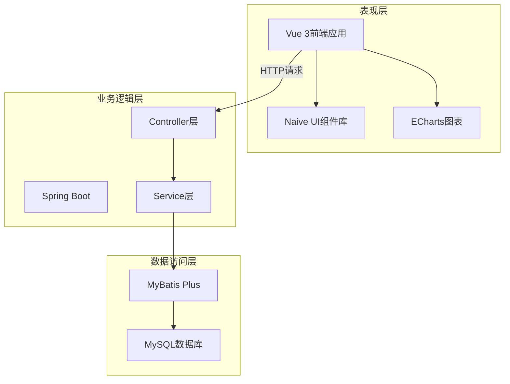
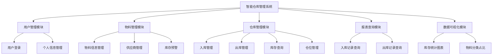
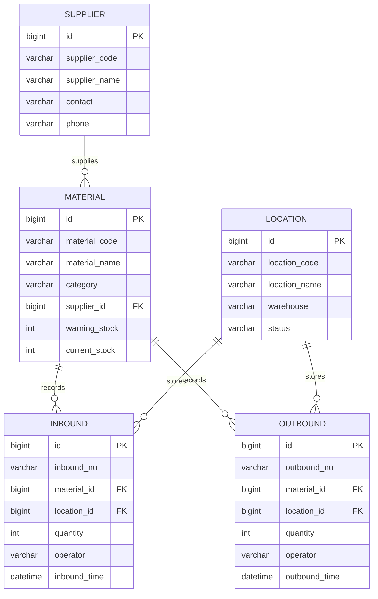

# 第4章 系统设计

系统设计是整个项目开发的核心环节，直接决定了系统的可扩展性和可维护性。在这一章里，会详细介绍智能仓库管理系统的总体架构、功能模块划分以及数据库设计方案。

## 4.1 系统总体架构设计

本系统采用前后端分离的架构模式。系统整体分为三层架构：表现层、业务逻辑层和数据访问层。前端使用Vue 3框架负责用户界面的展示和交互，后端使用Spring Boot框架处理业务逻辑和数据操作，数据库采用MySQL存储系统数据。前后端通过RESTful API进行数据交互，数据格式统一采用JSON。

[此处插入系统架构图]

图4-1 系统总体架构图

表现层主要负责与用户的交互，采用Vue 3作为前端框架，配合Naive UI组件库实现界面的快速开发。为了提升用户体验，系统在表现层做了一些优化，比如在数据加载时显示加载动画，操作成功或失败时弹出提示信息。

业务逻辑层是系统的核心部分，负责处理各种业务规则。Controller层接收前端的HTTP请求，调用Service层的业务方法，最后将处理结果封装成统一的JSON格式返回给前端。Service层实现具体的业务逻辑，比如入库操作不仅要保存入库记录，还要同步更新物料的库存数量，需要使用事务来保证数据的一致性。

数据访问层负责与数据库进行交互。系统使用MyBatis Plus作为持久层框架，Mapper接口继承BaseMapper就自动拥有了基本的CRUD方法。对于复杂的查询，可以在Mapper接口里自定义方法。

## 4.2 功能模块设计

根据系统的功能需求分析，将系统划分为五个主要功能模块。

[此处插入功能模块图]

图4-2 系统功能模块图

用户管理模块负责系统的用户认证和权限控制。系统设计了两种角色：普通用户和管理员。用户登录时，系统会验证用户名和密码，验证通过后生成token返回给前端。

物料管理模块是系统的基础模块，管理着仓库中所有物料的基本信息。每个物料都有唯一的物料编码，还包括物料名称、分类、单位、供应商、预警库存等信息。供应商管理是物料管理的一个子模块，每个物料可以关联一个供应商。库存预警功能可以帮助管理员及时了解库存不足的物料。

仓库管理模块是系统的核心业务模块，包括入库管理、出库管理、库存查询和仓位管理四个子模块。入库管理负责处理物料的入库操作，系统会自动生成入库单号，记录入库时间和操作人。出库管理需要先检查库存是否充足，如果出库数量大于当前库存，系统会提示库存不足。

报表查询模块提供各种数据查询功能，方便用户查看历史操作记录和统计数据。数据可视化模块使用ECharts图表库，将系统的各种统计数据以图表的形式直观展示出来。

## 4.3 数据库设计

数据库设计是系统设计的重要组成部分。本系统使用MySQL数据库，设计了6张核心数据表。

### 4.3.1 数据库概念设计

系统中的主要实体包括：用户、物料、供应商、仓位、入库记录、出库记录。实体之间的关系：物料和供应商是多对一关系，入库记录和物料是多对一关系，入库记录和仓位是多对一关系，出库记录和物料、仓位的关系与入库记录类似。

[此处插入E-R图]

图4-3 系统E-R图

### 4.3.2 数据库逻辑设计

根据E-R图，设计出具体的数据表结构。

表4-1 用户表结构

| 字段名 | 数据类型 | 长度 | 允许空 | 主键 | 索引 | 说明 |
|--------|----------|------|--------|------|------|------|
| id | BIGINT | - | 否 | 是 | 主键索引 | 用户ID，自增 |
| username | VARCHAR | 50 | 否 | 否 | 唯一索引 | 用户名，唯一 |
| password | VARCHAR | 100 | 否 | 否 | - | 密码 |
| nickname | VARCHAR | 50 | 是 | 否 | - | 昵称 |
| phone | VARCHAR | 20 | 是 | 否 | - | 手机号 |
| role | VARCHAR | 20 | 是 | 否 | 普通索引 | 角色：admin/user |

表4-2 物料表结构

| 字段名 | 数据类型 | 长度 | 允许空 | 主键 | 索引 | 说明 |
|--------|----------|------|--------|------|------|------|
| id | BIGINT | - | 否 | 是 | 主键索引 | 物料ID，自增 |
| material_code | VARCHAR | 50 | 否 | 否 | 唯一索引 | 物料编码，唯一 |
| material_name | VARCHAR | 100 | 否 | 否 | 普通索引 | 物料名称 |
| category | VARCHAR | 50 | 是 | 否 | 普通索引 | 物料分类 |
| unit | VARCHAR | 20 | 是 | 否 | - | 单位 |
| supplier_id | BIGINT | - | 是 | 否 | 外键索引 | 供应商ID |
| warning_stock | INT | - | 是 | 否 | - | 预警库存 |
| current_stock | INT | - | 是 | 否 | - | 当前库存 |

表4-3 供应商表结构

| 字段名 | 数据类型 | 长度 | 允许空 | 主键 | 索引 | 说明 |
|--------|----------|------|--------|------|------|------|
| id | BIGINT | - | 否 | 是 | 主键索引 | 供应商ID，自增 |
| supplier_code | VARCHAR | 50 | 否 | 否 | 唯一索引 | 供应商编码，唯一 |
| supplier_name | VARCHAR | 100 | 否 | 否 | 普通索引 | 供应商名称 |
| contact | VARCHAR | 50 | 是 | 否 | - | 联系人 |
| phone | VARCHAR | 20 | 是 | 否 | - | 联系电话 |
| address | VARCHAR | 200 | 是 | 否 | - | 地址 |

表4-4 仓位表结构

| 字段名 | 数据类型 | 长度 | 允许空 | 主键 | 索引 | 说明 |
|--------|----------|------|--------|------|------|------|
| id | BIGINT | - | 否 | 是 | 主键索引 | 仓位ID，自增 |
| location_code | VARCHAR | 50 | 否 | 否 | 唯一索引 | 仓位编码，唯一 |
| location_name | VARCHAR | 100 | 否 | 否 | - | 仓位名称 |
| warehouse | VARCHAR | 50 | 是 | 否 | 普通索引 | 所属仓库 |
| capacity | INT | - | 是 | 否 | - | 容量 |
| status | VARCHAR | 20 | 是 | 否 | 普通索引 | 状态 |

表4-5 入库记录表结构

| 字段名 | 数据类型 | 长度 | 允许空 | 主键 | 索引 | 说明 |
|--------|----------|------|--------|------|------|------|
| id | BIGINT | - | 否 | 是 | 主键索引 | 入库ID，自增 |
| inbound_no | VARCHAR | 50 | 否 | 否 | 唯一索引 | 入库单号，唯一 |
| material_id | BIGINT | - | 否 | 否 | 外键索引 | 物料ID |
| location_id | BIGINT | - | 是 | 否 | 外键索引 | 仓位ID |
| quantity | INT | - | 否 | 否 | - | 入库数量 |
| operator | VARCHAR | 50 | 是 | 否 | 普通索引 | 操作人 |
| inbound_time | DATETIME | - | 是 | 否 | 普通索引 | 入库时间 |

表4-6 出库记录表结构

| 字段名 | 数据类型 | 长度 | 允许空 | 主键 | 索引 | 说明 |
|--------|----------|------|--------|------|------|------|
| id | BIGINT | - | 否 | 是 | 主键索引 | 出库ID，自增 |
| outbound_no | VARCHAR | 50 | 否 | 否 | 唯一索引 | 出库单号，唯一 |
| material_id | BIGINT | - | 否 | 否 | 外键索引 | 物料ID |
| location_id | BIGINT | - | 是 | 否 | 外键索引 | 仓位ID |
| quantity | INT | - | 否 | 否 | - | 出库数量 |
| operator | VARCHAR | 50 | 是 | 否 | 普通索引 | 操作人 |
| outbound_time | DATETIME | - | 是 | 否 | 普通索引 | 出库时间 |

为了提高查询效率，在一些经常用于查询条件的字段上建立了索引。对于一些需要保证唯一性的字段，如各种编码字段，设置了唯一索引。考虑到入库和出库操作涉及多个表的数据修改，在Service层使用了事务管理，保证数据的一致性。
